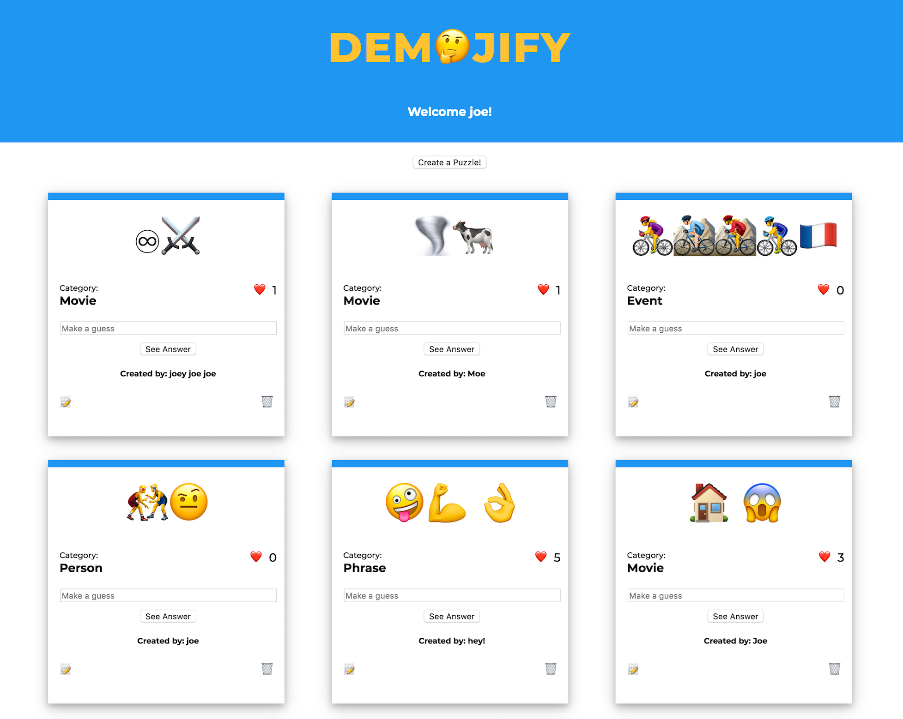

# “Demojify”

A single page app of emoji puzzles

A puzzle will have a clue, an answer, and a category

A puzzle can have many likes and many guesses

##### For example:
Clue: 🏒 💪 🦆

Category: Movie

Answer: Mighty Ducks

Clue: 🧐🥜

Category: Person

Answer: Mr. Peanut

#### MVP identified (CRUD):

A user will be able to:	
* Create a puzzle
* Update a puzzle
* Delete a puzzle
* Like a puzzle
* Make a guess on a puzzle

#### Stretch goals identified:
- sort/filter puzzles
- update auth for puzzle edit/delete
- display all guesses per puzzle
- emoji picker (like Slack)

#### Rough idea/draft of schema:

* User must enter their name to play
* Then they can see all the puzzles or create a puzzle
* The user can make a guess on a puzzle to reveal the answer
* Then they can choose to like the puzzle if they choose
