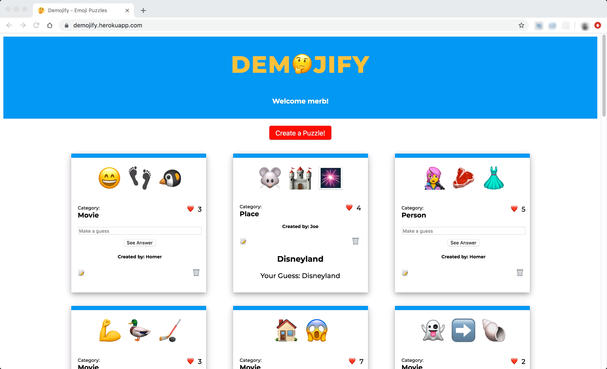

# “Demojify”

#### *An emoji puzzle app - Create and Solve emoji-based puzzles of your favorite movies, songs, people, and more!*



### Motivation

I've always loved puzzles and brain teasers, so I sometimes try to come up with fun riddles for people to solve. One day, I sent a co-worker something like this "🦔 📆📆📆📆📆📆📆📆📆..." and asked him to guess what movie it was. It took a while, but he eventually got it (Groundhog Day), and thus a game was born. Using this as my inspiration, I created Demojify so more people could enjoy creating and deciphering emoji puzzles. 

### Overview

The app is made up of a simple header and puzzle cards displayed in responsive rows. Once a user logs in, by simply entering a username, they will be able to see all of the current puzzles. Also, a red "Create a Puzzle" button will appear, which will display/hide a form to submit a puzzle when clicked.

On each individual puzzle card, a user can:
- make a guess that will display the answer, which they can compare with their own.
- click the heart emoji (❤️) to like the puzzle
- click the notepad emoji (📝) to open a modal to edit the puzzle 
- click the trashcan emoji (🗑) to delete the puzzle (with confirmation)

To log out, the user can simply close or refresh the page.

## Technology
- Ruby on Rails (backend API)
- Vanilla JS (frontend)
- PostgreSQL (database)
- Vanilla CSS (styling and layout)

## Installation

To run the app on your machine:

```
$ git clone <repo-name>

$ bundle install

$ rails db:setup (Make sure Postgres is running)

$ rails s
```

Live site is hosted at https://demojify.herokuapp.com. 


## License

MIT © jyang81
